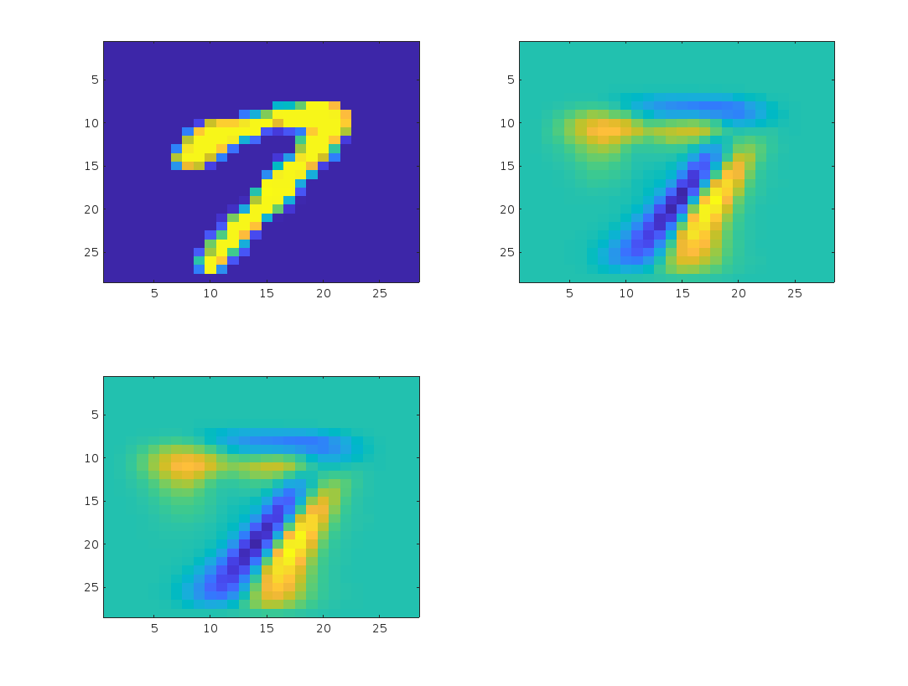

# Recovering PCA and Sparse PCA via Hybrid-(l1,l2) Sparse Sampling of Data Elements
Code to reproduce [Hybrid-(l1,l2) Element-Wise Matrix Sparsification](https://jmlr.org/papers/volume18/16-258/16-258.pdf) plus additional experiments.

---
## MNIST Experiment

We perform element-wise sparsification on the training set of MNIST using only the digit seven. We then reconstruct the original data using the first principle component and plot the results. In the image below, top left is the original image, top right is the reconstruction using the first PC of the sparse sketch and bottom left is the reconstruction using the first PC of the original image. 

